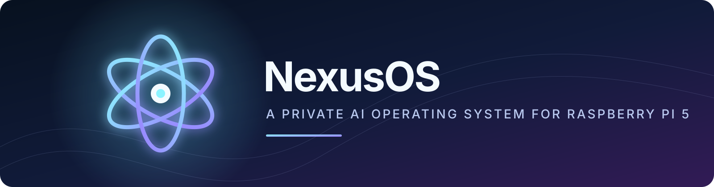
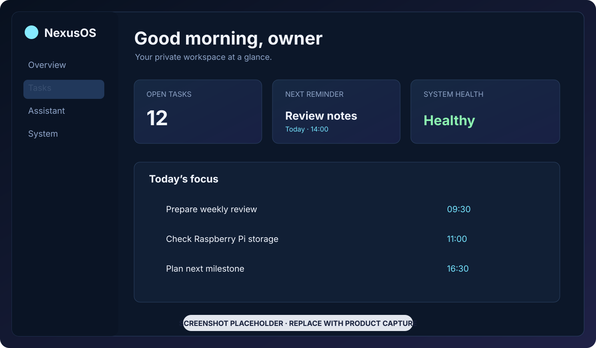

<p align="center">
  
</p>

<p align="center">
  <strong>A local-first personal AI operating system for the Raspberry Pi 5.</strong><br>
  Private by default. Modular by design. Built for your own hardware.
</p>

<p align="center">
  <a href="LICENSE"></a>
  <a href="https://github.com/onion3130/NexusOS/releases"></a>
  
  
  
  
  
</p>

NexusOS brings an authenticated dashboard, assistant, productivity tools, and read-only system monitoring together in one private, self-hosted application. It is designed for Raspberry Pi deployments with persistent data stored on an external SSD.

## Features

- 🤖 **AI assistant** — provider-neutral, bounded, and configured server-side
- ✅ **Task management** — due dates, priorities, categories, tags, recurring schedules, and reminders
- 📝 **Private notes** — versioned source notes with tags, archive, and soft deletion
- ⌕ **Scoped search** — local SQLite FTS5 search with source-aware excerpts and retrieval chunks
- 🔔 **Notifications** — persistent in-app alerts with a dedicated reminder worker
- 📈 **System telemetry** — read-only Raspberry Pi health and resource overview
- 🔐 **Security boundaries** — user-owned data, sessions, CSRF protection, permissions, confirmation workflows, and audit events
- 🛠️ **Safe maintenance** — explicit-confirmation SQLite backups, integrity checks, and recovery metadata without arbitrary host control
- 🌓 **Responsive dashboard** — accessible loading/error states and theme switching
- 🐳 **ARM64 deployment** — non-root Docker Compose services for local and Pi use

## Screenshots

> **Screenshot placeholder:** replace this mockup with a real product capture when the public dashboard showcase is ready.

<p align="center">
  
</p>

## Project status

| Item | Status |
| --- | --- |
| **Current milestone** | Milestone 10 — Deployment hardening ✅ |
| **Current version** | `1.0.0` — local-first release |
| **Next milestone** | Milestone 11 — Integrations and plugins |

NexusOS v1.0 is ready for private, local-first Raspberry Pi use. Milestone 10 adds an opt-in hardened LAN deployment with internal TLS, systemd startup, encrypted replication, and recovery procedures; target-Pi builds and restore drills remain required operational validation. See the [roadmap](docs/ROADMAP.md) for scope and follow-up work.

## Technology stack

- **Frontend:** Next.js 15, React 19, TypeScript 5.9
- **Backend:** FastAPI, Python 3.11+, SQLAlchemy
- **Database:** SQLite with Alembic migrations
- **Deployment:** Docker Compose, Linux ARM64, Raspberry Pi OS
- **AI:** Optional server-configured OpenAI-compatible or NVIDIA NIM provider

## Quick start

```sh
git clone https://github.com/onion3130/NexusOS.git
cd NexusOS
cp .env.example .env
# Replace JWT_SECRET in .env with a random value of at least 32 characters.
python scripts/validate_env.py --env-file .env
docker compose --env-file .env run --rm nexus-api python -m alembic upgrade head
docker compose --env-file .env run --rm nexus-api python -m app.cli.bootstrap_owner --username owner
docker compose --env-file .env up --build -d
```

Open `http://localhost:3000`. AI is disabled by default. For local development without Docker, read the [setup guide](docs/SETUP.md).

## Documentation

Use the [documentation index](docs/README.md) to find the right guide:

- [Setup](docs/SETUP.md) · [Deployment](docs/DEPLOYMENT.md) · [Development](docs/DEVELOPMENT.md)
- [Environment](docs/ENVIRONMENT.md) · [Security](docs/SECURITY.md) · [API](docs/API.md)
- [Architecture](docs/ARCHITECTURE.md) · [Database](docs/DATABASE.md) · [AI system](docs/AI_SYSTEM.md)
- [Roadmap](docs/ROADMAP.md) · [Changelog](CHANGELOG.md)

## Community

- [Contributing](CONTRIBUTING.md)
- [Code of Conduct](CODE_OF_CONDUCT.md)
- [Security policy](SECURITY.md)
- [MIT License](LICENSE)

## License

NexusOS is released under the [MIT License](LICENSE).
